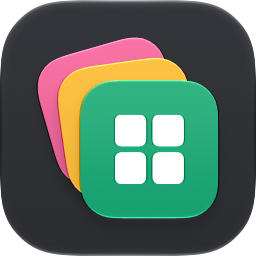
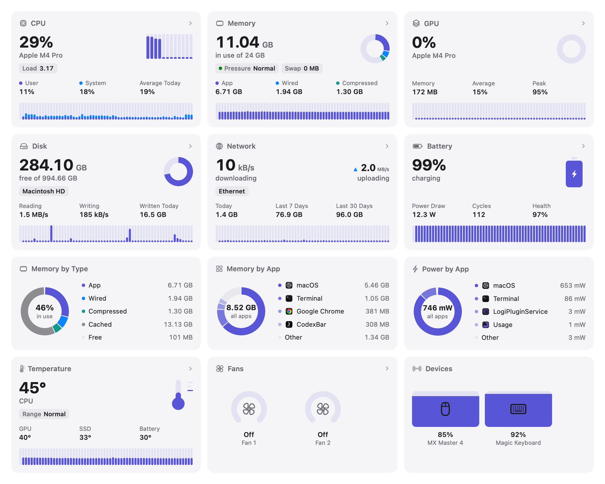
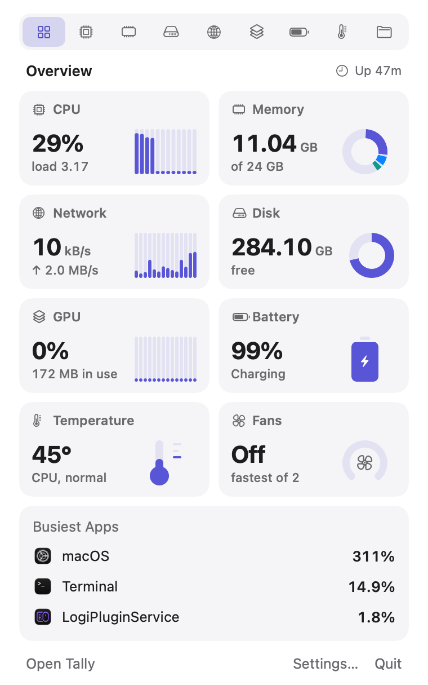

<p align="center">
  
</p>

<h1 align="center">Tally</h1>

<p align="center">
  A free, open-source system monitor for your Mac.<br>
  It adds every helper process to the app it works for. On the Mac that built it, 2,147 running processes come down to 79 apps.
</p>

<p align="center">
  <a href="https://github.com/dheerajkoppu/tally/releases/latest"></a>
  
  <a href="LICENSE"></a>
  <br>
  <a href="https://dheerajkoppu.github.io/tally/">Website</a> · <a href="https://github.com/dheerajkoppu/tally/releases/latest/download/Tally.zip">Download</a> · <a href="CONTRIBUTING.md">Contribute</a>
</p>

<p align="center">
  <picture>
    <source media="(prefers-color-scheme: dark)" srcset="docs/images/overview-dark.png">
    
  </picture>
</p>

## Download

1. [Download **Tally.zip**](https://github.com/dheerajkoppu/tally/releases/latest/download/Tally.zip) from the latest release.
2. Unzip it and drag **Tally** into your **Applications** folder.
3. Open Tally. The first time, macOS asks whether you want to open an app downloaded from the internet. Click **Open**.

Tally is signed with an Apple Developer ID and notarized, so Apple has checked every release for malicious software.

Tally needs macOS 15 Sequoia or later and runs on both Apple silicon and Intel Macs. Sensor and power readings are richer on Apple silicon.

## What it does

- **Apps, not processes.** Helper processes (renderers, GPU helpers, plugins, language servers) count toward the app that started them. One row per app, with its totals for CPU, memory, power, disk and network.
- **Separate views for each part of your Mac.** CPU, memory, disk, network, GPU and battery, each with a live chart and a ranked list of the apps driving it. Memory figures match Activity Monitor.
- **A month of history.** Scroll back to see what was busy while you were away, and which apps were responsible. It all lives in a single local database.
- **Alerts for runaway apps.** Get a heads-up when something pins the CPU, leaks memory, or won't stop writing to disk.
- **Local servers by project.** Servers and listening ports are filed under the repo they run from. Forgotten ones that haven't done anything in days get flagged, with a stop button that asks before it acts.
- **Menu bar monitor.** Choose a symbol, a live number, a mini chart or a stack of readings. Click it for the full picture.
- **Every network connection.** Ethernet and Wi‑Fi each show their own speed when you're on both.
- **SSD health.** How much rated life your drive has left, warnings it raises about itself, and everything written to and read from it since it was new.
- **Sensors in one place.** Every temperature your Mac reports, how fast the fans spin, and charge levels for wireless accessories. Manual fan control sits right beside the readings if you want it.
- **Quit and force quit.** From any list, and never without your confirmation.
- **Snapshots.** Save or copy an image of your stats or the whole dashboard, in light or dark.

<p align="center">
  <picture>
    <source media="(prefers-color-scheme: dark)" srcset="docs/images/menu-bar-dark.png">
    
  </picture>
</p>

## Light on your Mac

A system monitor shouldn't show up in its own list of busy apps. Tally refreshes every 5 seconds by default (you can pick 1, 2, 5 or 10), slows down further when no window is open, and runs its heavier checks far less often while you're not looking.

## Privacy

Tally only goes online when you choose **Check for Updates**, which asks GitHub for the latest version number. There's no account, no analytics and no background connections. Your apps, history and project names stay on your Mac. The code is all here, so you can check.

It asks for these permissions, and only when you use the feature that needs them:

| Permission             | Why                                                 |
| ---------------------- | --------------------------------------------------- |
| Notifications          | Alerts about runaway apps                           |
| Bluetooth              | Charge levels of wireless accessories               |
| Administrator password | Only if you install the optional fan-control helper |

## Updating

Choose **Tally › Check for Updates…** (it's also in Settings › About). If there's a new version, Tally takes you to the download. Replace the copy in Applications and your history and settings stay. Tally never checks on its own.

## Build from source

You need Xcode 27 or later (Xcode 26 works too, with the older tab style).

```bash
git clone https://github.com/dheerajkoppu/tally.git
cd tally
./scripts/build-app.sh
open build.noindex/Tally.app
```

`./scripts/build-app.sh debug` makes a debug build. See [CONTRIBUTING.md](CONTRIBUTING.md) for how the project is laid out and how to test your changes.

## Contributing

Bug reports, ideas and pull requests are welcome. Read [CONTRIBUTING.md](CONTRIBUTING.md) first. For security issues, see [SECURITY.md](SECURITY.md).

## License

[MIT](LICENSE). Use it, change it, share it.
